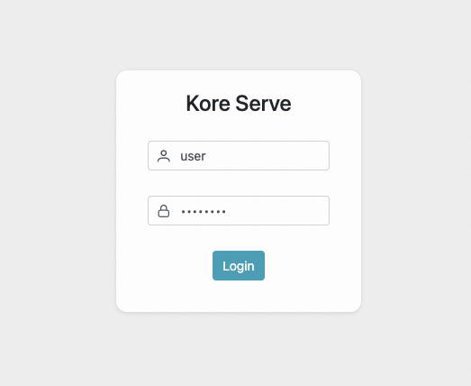
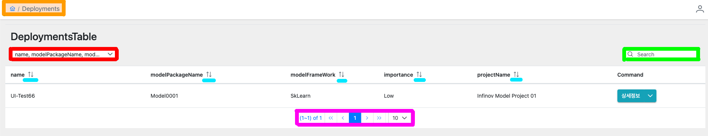
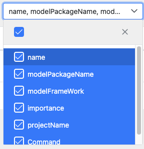
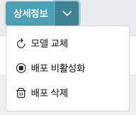
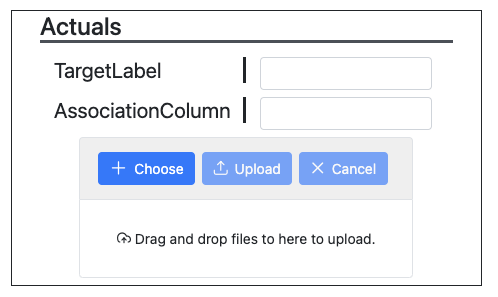
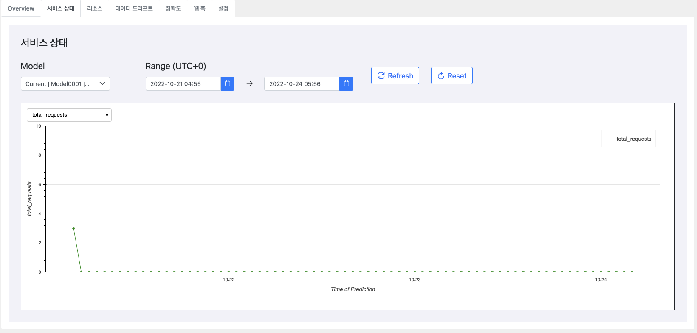

# MLops-Koreserve-FrontEnd

  > Google의 [MLops 2.0](https://cloud.google.com/architecture/mlops-continuous-delivery-and-automation-pipelines-in-machine-learning?hl=ko)(머신러닝 CI, CD, CT) 자동화 파이프라인 구현을 위한 정부국책과제 프로젝트 입니다. 해당 파트는 배포 모델이 생성 된 후에 UI로 모니터링 할 수 있는 FrontEnd 부분입니다.
  >> CI : 지속적 통합
  >> CD : 지속적 배포
  >> CT : 지속적 학습
  >> 하단 그림의 6번 부분의 구현

- [Google MLops 2.0](https://cloud.google.com/architecture/mlops-continuous-delivery-and-automation-pipelines-in-machine-learning?hl=ko)

## 목차

- [MLops-Koreserve-FrontEnd](#mlops-koreserve-frontend)
  - [목차](#목차)
    - [프로젝트 정보](#프로젝트-정보)
      - [실행방법](#실행방법)
      - [기술스택](#기술스택)
      - [LICENSE](#license)

### 프로젝트 정보

#### 실행방법

- [Local Nuxt 실행방법](readmeFile/localNuxt.md)
- [Docker Image 생성 및 실행](readmeFile/docker.md)
- [K8s 환경 실행](readmeFile/k8s.md)

#### 기술스택

   ![PrimeVue](https://img.shields.io/badge/PrimeVue-black?style=plastic&logo=data:image/svg+xml;base64,PHN2ZyB3aWR0aD0iMzUiIGhlaWdodD0iNDAiIHZpZXdCb3g9IjAgMCAzNSA0MCIgZmlsbD0ibm9uZSIgeG1sbnM9Imh0dHA6Ly93d3cudzMub3JnLzIwMDAvc3ZnIj4KPHBhdGggZD0iTTI1LjU3MzkgMTguMDQ1OEwyMi44NjYxIDE3LjQ0NDNMMjQuOTcyMiAyMC40NTE5VjI5Ljc3NTZMMzIuMTkzIDIzLjc2MDNWMTMuNTM0M0wyOC44ODM1IDE0LjczNzRMMjUuNTczOSAxOC4wNDU4WiIgZmlsbD0iIzQxQjg4MyIvPgo8cGF0aCBkPSJNOC43MjUyMiAxOC4wNDU4TDExLjQzMyAxNy40NDQzTDkuMzI2OTYgMjAuNDUxOVYyOS43NzU2TDIuMTA2MDkgMjMuNzYwM1YxMy41MzQzTDUuNDE1NjUgMTQuNzM3NEw4LjcyNTIyIDE4LjA0NThaIiBmaWxsPSIjNDFCODgzIi8+CjxwYXRoIGZpbGwtcnVsZT0iZXZlbm9kZCIgY2xpcC1ydWxlPSJldmVub2RkIiBkPSJNMTAuMjI5NiAyMS4wNTM0TDEyLjYzNjUgMTcuNDQ0M0wxNC4xNDA5IDE4LjM0NjZIMjAuMTU4MkwyMS42NjI2IDE3LjQ0NDNMMjQuMDY5NiAyMS4wNTM0VjM0LjU4NzhMMjIuMjY0MyAzNy4yOTQ3TDIwLjE1ODIgMzkuNEgxNC4xNDA5TDEyLjAzNDggMzcuMjk0N0wxMC4yMjk2IDM0LjU4NzhWMjEuMDUzNFoiIGZpbGw9IiM0MUI4ODMiLz4KPHBhdGggZD0iTTI0Ljk3MjIgMzUuNDkwMUwyOC44ODM1IDMxLjU4MDJWMjcuNjcwMkwyNC45NzIyIDMwLjk3ODZWMzUuNDkwMVoiIGZpbGw9IiM0MUI4ODMiLz4KPHBhdGggZD0iTTkuMzI2OTcgMzUuNDkwMUw1LjQxNTY2IDMxLjU4MDJWMjcuNjcwMkw5LjMyNjk3IDMwLjk3ODZWMzUuNDkwMVoiIGZpbGw9IiM0MUI4ODMiLz4KPHBhdGggZmlsbC1ydWxlPSJldmVub2RkIiBjbGlwLXJ1bGU9ImV2ZW5vZGQiIGQ9Ik0yMS4wNjA5IDBIMjAuMTU4M1Y1Ljc5ODhMMjEuODE0MSAxLjc4ODQyTDIxLjA2MDkgMFpNMTkuNTc2MiA3LjIwODQ5TDE4Ljk1NDggNy41MTkwOFYwSDE3Ljc1MTNWMTEuNjI4MUwxOS41NzYyIDcuMjA4NDlaTTE3Ljc1MTMgMTQuMjQ4M0wyMi4zNjA1IDMuMDg1NDlMMjMuNDY3OCA1LjcxNDVMMTkuODU3NCAxNy4xNDM1SDE3Ljc1MTNWMTQuMjQ4M1pNMTYuNTQ3OCAxMS42NzE4VjBIMTUuMzQ0M1Y3LjUxOTA4TDE0Ljg0MzQgNy4yNjg2OUwxNi41NDc4IDExLjY3MThaTTE0LjE0MDkgNS40NTM4NVYwSDEzLjIzODNMMTIuNjA4NSAxLjQ5NTE5TDE0LjE0MDkgNS40NTM4NVpNMTIuMDQ5NyAyLjgyMTgxTDE2LjU0NzggMTQuNDQxOVYxNy4xNDM1SDE0Ljc0MjZMMTAuODMxMyA1LjcxNDVMMTIuMDQ5NyAyLjgyMTgxWiIgZmlsbD0iIzQ1NUM3MSIvPgo8cGF0aCBmaWxsLXJ1bGU9ImV2ZW5vZGQiIGNsaXAtcnVsZT0iZXZlbm9kZCIgZD0iTTEuODA1MjIgMTIuMzMxM0wxNC43NDI2IDE3LjE0MzVIMTUuMDQzNUwxMS4xMzIyIDUuNzE0NUwwIDQuODEyMjFMMS44MDUyMiAxMi4zMzEzWk0zMi43OTQ4IDEyLjMzMTNMMTkuODU3NCAxNy4xNDM1SDE5LjU1NjVMMjMuMTY3IDUuNzE0NUwzNC42IDQuODEyMjFMMzIuNzk0OCAxMi4zMzEzWiIgZmlsbD0iIzQxQjg4MyIvPgo8cGF0aCBkPSJNMjQuMDY5NiA0LjgxMjIxTDMwLjM4NzggNC4yMTA2OUwyNi4xNzU3IDBIMjEuOTYzNUwyNC4wNjk2IDQuODEyMjFaIiBmaWxsPSIjNDU1QzcxIi8+CjxwYXRoIGQ9Ik0xMC4yMjk1IDQuODEyMjFMMy45MTEyOSA0LjIxMDY5TDguMTIzNDYgMEgxMi4zMzU2TDEwLjIyOTUgNC44MTIyMVoiIGZpbGw9IiM0NTVDNzEiLz4KPHBhdGggZD0iTTQuNzAwMDEgNS4yTDExLjIgNS43TDE1LjEgMTcuMTVIMTQuN0wxMC41IDE1LjZMNC43MDAwMSA1LjJaIiBmaWxsPSIjNDU1QzcxIi8+CjxwYXRoIGQ9Ik0yOS44IDUuMkwyMy4xIDUuN0wxOS40IDE3LjE1TDE5LjkgMTcuMTRMMjMuOCAxNS43TDI5LjggNS4yWiIgZmlsbD0iIzQ1NUM3MSIvPgo8cGF0aCBkPSJNMTIuMSAxOC4yTDEyLjYgMTcuNEwxNC4zIDE4LjJIMjAuM0wyMS42IDE3LjRMMjIuMiAxOC4yTDE3LjE1IDI2LjhMMTIuMSAxOC4yWiIgZmlsbD0iIzQ1NUM3MSIvPgo8cGF0aCBmaWxsLXJ1bGU9ImV2ZW5vZGQiIGNsaXAtcnVsZT0iZXZlbm9kZCIgZD0iTTEyLjAyOTcgMEwxNy4xMjE0IDEzLjE1MzZMMjIuNTUyNiAwSDEyLjAyOTdaIiBmaWxsPSIjNDFCODgzIi8+Cjwvc3ZnPg==&logoColor=white)
<!--  -->

- 구현 기능
  - Login
    - 
    - Login시에 BackEnd에 요청하고 JWT 토큰을 가져와 Session Storege에 저장한다.

      

  - [DataTable](https://www.primefaces.org/primevue/datatable)
    - Filter, Sort, Column selete, Paginator
    - Active, InActive 여부에 따라 다르게 표시

      

      

      

  - Save Setting
    - 각각의 맞는 정보를 입력 후 Json 형식으로 BackEnd 보내서 통신한다.

  - Status View
    - Good, Failing, Atrisk, Error 별로 현재 상태를 다르게 표시

    

  - [FileUpload](https://www.primefaces.org/primevue/fileupload)
    - Dropdown
    - BackEnd Server로 해당 파일을 보낸 후 ProgressSpiner를 표현한 후 응답에 따른 Toast Msg 표시

    

  - [Breadcrumb](https://www.primefaces.org/primevue/breadcrumb)
    - 경로 표시 및 클릭 시 해당 경로로 이동

      

  - Graph
    - 원하는 날짜에 따라서 조회가 가능하고 최소 날짜, 최대 날짜가 정해져 있다.
    - 해당하는 모델에 따라서 날짜가 변경된다.

    

---

#### LICENSE

